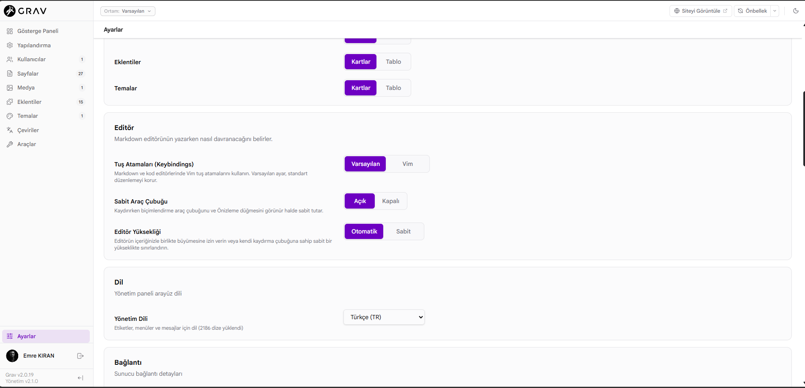

# Grav Admin2 Turkish Localization

**Turkish localization for the Grav CMS Admin2 administration panel.**

**Grav CMS Admin2 yönetim paneli için Türkçe yerelleştirme.**

---

## 🇬🇧 English

### About

This repository provides a Turkish localization for the **Grav CMS Admin2** administration panel.

The purpose of this project is to provide a fully Turkish administrative interface for users who prefer to manage their Grav CMS websites in Turkish.

The localization is provided as a standalone `tr-TR.yaml` language file and can be installed without modifying the Admin2 source code.

### Compatibility

* **Grav CMS:** `>= 2.0.0`
* **Admin2:** `2.x`
* **Language:** Turkish (`tr-TR`)
* **File format:** YAML

> **Important:** This localization is specifically intended for the modern Grav Admin2 administration panel running on Grav 2.x. It is not intended to provide localization for the legacy/classic Admin interface.

### Installation

Copy the following file into your Grav installation:

```text
user/plugins/admin2/languages/tr-TR.yaml
```

The final directory structure should look like:

```text
user/
└── plugins/
    └── admin2/
        └── languages/
            └── tr-TR.yaml
```

No modification to the Admin2 source code is required.

Admin2 uses Grav's standard language pipeline and automatically discovers language files placed in the plugin's `languages/` directory.

### Enable Turkish Language

After copying the file:

1. Log in to the Grav Admin2 panel.
2. Open **Settings**.
3. Find **Admin Language**.
4. Select **Türkçe (TR)**.
5. Save the settings if required.
6. Reload the administration panel.

Once installed, the Turkish language becomes available through Admin2's **Admin Language** selector.

### Technical Details

Admin2 uses Grav's language infrastructure together with the modern ICU MessageFormat system.

This localization includes translations for the Admin2 interface and associated administrative terminology.

The translation file may contain:

* Standard Grav translation keys
* Admin2-specific translation keys
* ICU MessageFormat strings
* Placeholders
* Pluralization rules
* Select expressions
* Other language-specific message formatting

The Turkish localization preserves the existing Admin2 translation structure and key names.

This allows the localization to be installed independently without modifying the Admin2 source code.

### Why a Separate Language File?

The localization is intentionally distributed as a standalone language file.

This approach provides several advantages:

* No modification of Admin2 source files is required.
* The localization can be installed independently.
* Updates to Admin2 can be applied without manually merging translated source files.
* The language file can be updated independently from the Admin2 codebase.
* The localization can be tested and maintained separately.

### Screenshot

Example of the Turkish Admin2 administration panel:



### Project Status

This is a community-maintained Turkish localization for Grav CMS Admin2.

The translation is provided as a standalone language file and is intended to be easy to install, maintain and update.

### Contributing

Contributions, corrections and translation improvements are welcome.

If you find:

* a missing translation,
* an incorrect Turkish translation,
* a spelling or terminology issue,
* an untranslated Admin2 string,
* an incorrectly translated placeholder,
* or a compatibility problem,

please open an issue or submit a pull request.

### Upstream Project

This project is an independent Turkish localization for the official **Grav CMS Admin2** project.

Official resources:

* [Grav CMS](https://getgrav.org)
* [Grav CMS GitHub Repository](https://github.com/getgrav/grav)
* [Grav Admin2 GitHub Repository](https://github.com/getgrav/grav-plugin-admin2)
* [Grav Documentation](https://learn.getgrav.org)
* [Grav Admin Translations Documentation](https://learn.getgrav.org/20/plugins/admin-translations)

For Admin2 releases, technical documentation, issues and contribution guidelines, please refer to the official upstream project.

---

## 🇹🇷 Türkçe

### Hakkında

Bu repository, **Grav CMS Admin2** yönetim paneli için Türkçe yerelleştirme sağlar.

Projenin amacı, Grav CMS web sitelerini Türkçe yönetmek isteyen kullanıcılar için Admin2 yönetim panelini mümkün olduğunca tamamen Türkçe hale getirmektir.

Yerelleştirme, bağımsız bir `tr-TR.yaml` dil dosyası olarak hazırlanmıştır ve Admin2 kaynak kodunda herhangi bir değişiklik yapılmasını gerektirmez.

### Uyumluluk

* **Grav CMS:** `>= 2.0.0`
* **Admin2:** `2.x`
* **Dil:** Türkçe (`tr-TR`)
* **Dosya formatı:** YAML

> **Önemli:** Bu yerelleştirme özellikle Grav 2.x üzerinde çalışan modern Grav Admin2 yönetim paneli için hazırlanmıştır. Eski/klasik Admin arayüzünün yerelleştirilmesini amaçlamaz.

### Kurulum

Aşağıdaki dosyayı Grav kurulumunuzdaki ilgili dizine kopyalayın:

```text
user/plugins/admin2/languages/tr-TR.yaml
```

Son klasör yapısı aşağıdaki gibi olmalıdır:

```text
user/
└── plugins/
    └── admin2/
        └── languages/
            └── tr-TR.yaml
```

Admin2 kaynak kodunda herhangi bir değişiklik yapılmasına gerek yoktur.

Admin2, Grav'ın standart dil altyapısını kullanır ve eklentinin `languages/` dizinine yerleştirilen dil dosyalarını otomatik olarak algılar.

### Türkçe Dilini Etkinleştirme

Dosyayı kopyaladıktan sonra:

1. Grav Admin2 yönetim paneline giriş yapın.
2. **Ayarlar** bölümünü açın.
3. **Yönetim Dili** seçeneğini bulun.
4. **Türkçe (TR)** seçeneğini seçin.
5. Gerekirse ayarları kaydedin.
6. Yönetim panelini yeniden yükleyin.

Kurulum tamamlandıktan sonra Türkçe, Admin2 içerisindeki **Yönetim Dili** seçiminde kullanılabilir hale gelir.

### Teknik Bilgiler

Admin2, Grav'ın dil altyapısını ve modern ICU MessageFormat sistemini kullanır.

Bu yerelleştirme Admin2 arayüzü ve ilgili yönetim paneli terminolojisi için Türkçe çeviriler içerir.

Dil dosyasında aşağıdaki yapılar bulunabilir:

* Standart Grav çeviri anahtarları
* Admin2'ye özel çeviri anahtarları
* ICU MessageFormat ifadeleri
* Placeholder/değişkenler
* Çoğul ifadeler
* Select ifadeleri
* Dile özgü diğer mesaj biçimlendirme yapıları

Türkçe yerelleştirme, mevcut Admin2 çeviri yapısını ve anahtar isimlerini koruyacak şekilde hazırlanmıştır.

Bu sayede Admin2 kaynak koduna müdahale edilmeden bağımsız olarak kurulabilir.

### Neden Ayrı Bir Dil Dosyası?

Yerelleştirme özellikle bağımsız bir dil dosyası olarak dağıtılmaktadır.

Bu yaklaşımın avantajları:

* Admin2 kaynak dosyalarının değiştirilmesine gerek kalmaz.
* Yerelleştirme bağımsız olarak kurulabilir.
* Admin2 güncellemeleri sırasında kaynak dosyaların elle birleştirilmesi gerekmez.
* Dil dosyası Admin2 kodundan bağımsız olarak güncellenebilir.
* Yerelleştirme ayrı olarak test edilebilir ve sürdürülebilir.

### Ekran Görüntüsü

Türkçeleştirilmiş Grav Admin2 yönetim panelinden örnek:


### Proje Durumu

Bu proje, Grav CMS Admin2 için topluluk tarafından geliştirilen bir Türkçe yerelleştirmedir.

Çeviri bağımsız bir dil dosyası olarak sunulmakta ve kolayca kurulabilmesi, güncellenebilmesi ve sürdürülebilmesi amaçlanmaktadır.

### Katkıda Bulunma

Katkılar, düzeltmeler ve çeviri geliştirmeleri memnuniyetle karşılanır.

Aşağıdaki durumlardan birini fark ederseniz issue açabilir veya pull request gönderebilirsiniz:

* eksik bir çeviri,
* hatalı Türkçe çeviri,
* yazım veya terminoloji problemi,
* İngilizce kalmış Admin2 metni,
* hatalı çevrilmiş placeholder/değişken,
* veya uyumluluk problemi.

### Kaynak Proje

Bu proje, resmi **Grav CMS Admin2** projesi için bağımsız bir Türkçe yerelleştirmedir.

Resmî kaynaklar:

* [Grav CMS](https://getgrav.org)
* [Grav CMS GitHub Repository](https://github.com/getgrav/grav)
* [Grav Admin2 GitHub Repository](https://github.com/getgrav/grav-plugin-admin2)
* [Grav Dokümantasyonu](https://learn.getgrav.org)
* [Grav Admin Çeviri Dokümantasyonu](https://learn.getgrav.org/20/plugins/admin-translations)

Admin2 sürümleri, teknik dokümantasyon, issue kayıtları ve katkıda bulunma kuralları için resmi upstream projeyi takip edebilirsiniz.

---

## Official Resources

* [Grav CMS](https://getgrav.org)
* [Grav CMS GitHub Repository](https://github.com/getgrav/grav)
* [Grav Admin2 GitHub Repository](https://github.com/getgrav/grav-plugin-admin2)
* [Grav Documentation](https://learn.getgrav.org)
* [Grav Admin Translations Documentation](https://learn.getgrav.org/20/plugins/admin-translations)

---

## License

This repository contains a localization file intended for use with the Grav CMS Admin2 project.

Please refer to the upstream Admin2 project for the applicable project license and licensing information.

[Grav Admin2 License](https://github.com/getgrav/grav-plugin-admin2/blob/develop/LICENSE)

---

## Acknowledgements

Thanks to the **Grav CMS** and **Admin2** contributors for the open-source project and its localization infrastructure.

Türkçe yerelleştirmenin hazırlanmasına olanak sağlayan Grav CMS ve Admin2 geliştiricilerine ve katkıda bulunan topluluğa teşekkürler.
